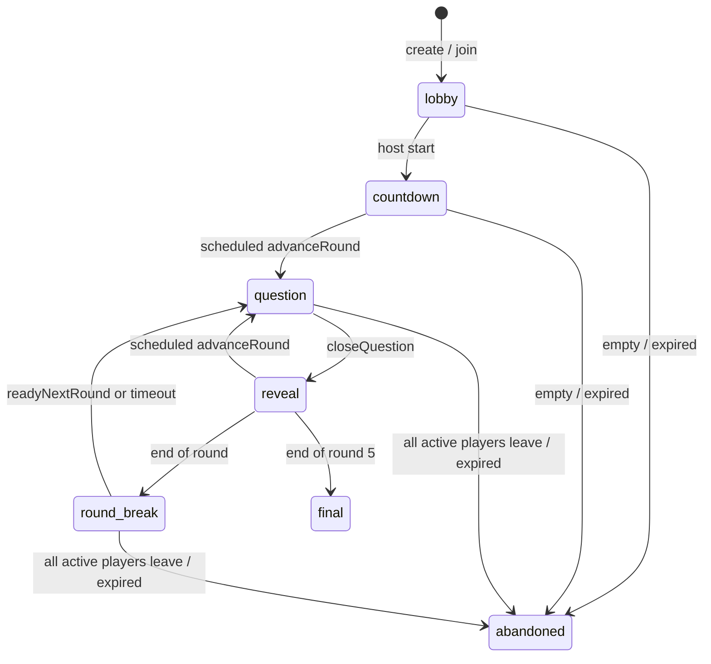

# Challenge Arena

Challenge Arena is the additive backend for synchronous, server-clocked,
multiplayer rooms. It does not replace `liveMatches`, async `duels`, or the
curated football-only modes.

## Scope

MVP modes:

- `1v1`
- `2v2`
- `ffa3`
- `ffa4`
- `ffa5`

Out of scope: ELO, matchmaking, chat, tournaments, leagues, and global
leaderboards.

## State Machine

`closeQuestion` and `advanceRound` are internal scheduled functions. A live
client is never required to move a room forward.

## Server Authority

The room locks all five rounds when the host starts:

- round 1: football quiz (`sport: "football"`, max 2 image questions per
  10-question round)
- round 2: general knowledge (`sport: "knowledge"`, sampled from the full
  arena-eligible knowledge pool)
- round 3: which came first (`category: "which_came_first"`)
- round 4: enterprise logos (`category: "enterprise_logos"`, `kind: "logo_text"`)
- round 5: capital cities (`category: "capital_cities"`)

All players share the same `roundChecksums[][]`. Clients never submit
`correctAnswer`, score, checksum, round, question index, or timing. The submit
mutation accepts only `{ arenaId, answer }`, loads the active checksum from the
arena row, loads the question by `quizQuestions.by_checksum`, validates the
answer server-side, and derives `serverTimeMs` from
`Date.now() - questionStartedAt`.

The reactive room query omits locked checksums and strips the active question's
`correctAnswer`. Current-question answers from other players are hidden until
the question closes.

Question payloads include a `kind` discriminator:

- `mcq`: standard multiple-choice questions
- `which_came_first`: two-option which-came-first questions
- `logo_text`: enterprise logo image with free-text guesses

For `logo_text`, the active public payload exposes the logo image path only
alongside category/difficulty metadata. It never exposes the company name,
accepted aliases, options, checksum, or answer text before reveal.

Logo guesses are infinite and unpenalized. A correct fuzzy match against the
canonical answer or aliases records one correct answer row with server-derived
time and locks that player. Wrong guesses return `{ result: "wrong" }`; if the
guess is one edit beyond the accept threshold, the server also returns
`{ close: true }` without returning the target string. Wrong guesses do not lock
the player out. Logo questions close when the timer expires or every active
player has a correct answer. Reveal exposes the company name and logo.

## Scoring

At close:

- wrong or missed: `0`
- correct: `100 + round(100 * max(0, (window - serverTimeMs) / window)) + rankBonus`
- rank bonus by correct-answer order: `[50, 30, 20, 10, 10]`

Individual `totalScore` is accumulated on the arena player row. In `2v2`, team
leaderboards sum member scores. `round_break` exposes the completed round
leaderboard; `final` exposes the final podium across all rounds.

## Final Summary

`challengeArenas.getArenaSummary({ arenaId })` is a read-only, player-only query
available only after the arena status is `final`. It returns the compact stats
needed by the Arena podium screen, derived from `arenaAnswers` instead of
trusting client-submitted values or hardcoded match sizes.

Summary meta includes `mode`, `isTeamMode`, and `totalQuestions`, where
`totalQuestions = arena.config.rounds * arena.config.perRound`.

Per-player stats:

- `totalScore`: sum of that player's `arenaAnswers.points`
- `questionsAnswered`: submitted answer rows for that player
- `correctAnswers`: submitted answer rows with `correct: true`
- `accuracy`: `correctAnswers / questionsAnswered`; players with no submitted
  answers return `0` accuracy and are not eligible for the sharpshooter
  superlative
- `avgCorrectMs`: average `serverTimeMs` over correct answers only; `null` when
  the player has no correct answers
- `longestStreak`: longest run of correct answers across the whole match slot
  order. Wrong answers and missed questions break the streak, and the streak
  does not reset at round boundaries.

Superlatives return raw tied winners as arrays. Presentation layers can decide
later whether to spread awards:

- `fastest`: lowest `avgCorrectMs` among players with at least one correct answer
- `sharpshooter`: highest `accuracy` among players with at least one submitted
  answer
- `hotStreak`: highest `longestStreak` among players with a streak greater than
  zero

The summary also returns final player rankings. In `2v2`, it additionally
returns ranked team totals computed as the sum of member answer-row scores.

## Rematch

`challengeArenas.rematch({ arenaId })` is available only after the source arena
has reached `final`. The first rematch call for that source arena creates one
new normal lobby, copies the original crew with fresh `ready: false` state, and
stamps `rematchArenaId` plus `rematchArenaCode` onto the finished arena.
Later calls from any player in the same finished arena return that same stamped
lobby instead of creating another room.

Both `getRoom` and `getArenaSummary` expose the stamped rematch fields on the
old final arena, so clients still viewing the results screen can reactively
switch their action from creating a lobby to joining the already-created
rematch code. The new lobby uses the standard `join`, `setReady`, team, and
start mutations.

When the source arena is `final`, `ArenaShell` renders a sticky **Rematch lobby
is open — join the crew** banner the moment `room.rematchArenaCode` reactively
populates. Every other player still on the final screen sees that banner appear
and taps into the same `/arena/<code>` as the initiator, so the crew always
lands in one shared lobby (no solo rematches).

## Leave Safety

Leaving marks the player `left: true` and freezes their current score. The room
continues for remaining active players. If the host leaves, host ownership
transfers to the first remaining active player. If all active players leave,
the arena is abandoned.

Lobby force-start is available after a short grace period. Unready non-host
players are marked left before the room starts, so an AFK player cannot trap the
room.

## Content Sources

Challenge Arena uses the existing `quizQuestions` table and indexes:

- `by_sport_difficulty`
- `by_checksum`

Capital-city, general-knowledge, and enterprise-logo arena gap seeds are
bundled in `challengeArenaContent.ts` and upserted idempotently when an arena
starts if the database lacks them. `internal.challengeArenas.seedContentGaps`
can run the same upsert deliberately for environments that have not started an
arena yet.

Capital-city coverage is 195 prompts: the 193 UN Member States plus the Holy
See and State of Palestine observer states. The country coverage follows the
UN membership resources and observer-state count; capital names are
cross-checked against country profile data and special cases such as Bolivia,
Nauru, South Africa, the Holy See, and the State of Palestine use explicit
question wording.

The arena general-knowledge seed set reuses the curated `knowledgeQuestions`
pool, excluding only dedicated `which_came_first`, `enterprise_logos`, and
`capital_cities` categories. `contentStatus.generalKnowledge` therefore
includes science disciplines, history, geography, arts/culture, language,
inventions/discoveries, and fun facts instead of being limited to a small
common-knowledge bucket.

Football quiz selection uses a seeded shuffle over the full eligible football
pool, but caps image-bearing questions (`imageId` or `imageUrl`) at two per
10-question football round and fills the rest from text-only football
questions.

Enterprise logos use the `enterprise_logos` category, `questionKind:
"logo_text"`, canonical answer names, and accepted aliases. The logo seed set
has 144 entries, enough to fill 10-question logo rounds without repeats inside
a match. Source SVG files are copied from Simple Icons 16.20.0 into
`app/public/arena-logos/simple-icons`, then served to clients only through
opaque hashed copies in `app/public/arena-logos/opaque`; returned `imageUrl`
values do not include brand slugs, so the network path does not reveal the
answer and the frontend can preload safely. Simple Icons SVG representations
are licensed CC0-1.0. Brand names and logos may still be trademarks of their
respective owners; the arena uses them for identification in a quiz context.
This is not legal advice.

`challengeArenas.contentStatus` reports the live content counts used for this
decision, including `footballQuizText`, `footballQuizImages`,
`footballImageQuestionCap`, `generalKnowledge`, `capitalCities`, and the
bundled seed counts.

## Cron

`challenge-arena-expiry` runs hourly and abandons expired non-final arenas in a
bounded batch.

## Frontend (MVP)

The Challenge Arena UI lives in `app/src/pages/ChallengeArenaScreen.tsx` (lazy-
loaded, route `/arena/:code`, wrapped in the global `ErrorBoundary` and gated by
`UsernameRequiredRoute`). Two entry points sit at the top of the Challenge tab:

- `app/src/pages/arena/CreateArenaModal.tsx` — pick mode (1v1 / 2v2 / FFA 3-5)
  then `challengeArenas.create` and redirect to `/arena/<code>`.
- `app/src/pages/arena/JoinArenaModal.tsx` — accept a normalised code and
  redirect to `/arena/<code>`.

Everything inside the room is driven by a single reactive `useQuery` on
`challengeArenas.getRoom`. The component renders one of six sub-views based on
`phase`:

| Phase | Sub-view | Notes |
|-------|----------|-------|
| `lobby` | `LobbyView` | Roster, ready toggles, team picker for 2v2, share/copy link, host start + force-start with countdown gated by `forceStartAvailableAt`. Lists explicit "waiting on" reasons (player count, team validity, unready names). |
| `countdown` | `CountdownView` | 3-2-1 anchored to the first observed phase change (no authoritative start timestamp on the room) plus a preview chip for round 1's category. |
| `question` | `QuestionView` | Server-clocked timer bar (`timer.questionStartedAt` + `timer.questionWindowMs`, offset corrected via `useClockOffset` against `timer.serverNow`). MCQ for football/general rounds, 1-column big two-option layout for `which_came_first`, and logo image + `NeoInput` text field for `logo_text`. MCQ uses **tap-to-submit**: tapping an option calls `submitAnswer` immediately. Logo text guesses submit on Enter or via an `ArrowRight` submit button — repeated guesses are unlimited (server tracks speed; no client penalty). The server response drives a single inline status line under the input: `wrong` → "Nope — try again" (input cleared and refocused), `wrong + close` → "So close — one letter off!", `correct` → "Got it!" with the locked-in waiting copy. The client never reads the answer or aliases — it only renders backend verdicts. Locked state is read back from `room.myCurrentAnswer` so refresh resumes. Errors like "already answered" are swallowed; everything else toasts and clears local pending state so the player can retry. |
| `reveal` | `RevealView` | Correct answer banner, per-player answer list sorted by points + speed, my own verdict + running total. |
| `round_break` | `RoundBreakView` | Round leaderboard from `room.roundLeaderboard` (team totals in 2v2 are already aggregated by the backend), preview of next category, ready button calling `readyNextRound`, a local 8s "auto-advance" hint (server schedules the real advance). |
| `final` | `FinalView` | Subscribes to `challengeArenas.getArenaSummary({ arenaId })` and renders three sub-blocks: an orange neo-brutalist hero ("Champion" for solo modes, "Winning team" for 2v2, using `rankings.players[0]` / `rankings.teams[0]`), three award chips (`fastest` / `sharpshooter` / `hotStreak` — joining tied winners as "A & B", no diversification), and a `FinalStandingsCard` table (`# / Player / Score / Acc / Avg`). 2v2 inserts a `T-A`/`T-B` team marker row above each team's members, teams ranked by total; players are numbered 01..N across the whole list. Per-player ACC / AVG render as `—` when a player has no submitted answers or no correct answers. Actions: `REMATCH — same crew` (orange primary, calls the existing rematch flow) + `Share result` (Web Share API with copy fallback, payload tailored to solo vs. team). Loading state shows a tally placeholder; `summary === null` (not final yet, or unauthorised reader) falls back to a "results unavailable" card with the same rematch + share affordances. |

Cross-cutting:

- A persistent header strip across every phase shows the code, mode, current
  phase + round, and a **Leave** button that calls `leave` then navigates back
  to `/challenge`. Leaving never blocks; rejoining is just re-opening the same
  code.
- During the `lobby` phase the header also surfaces a **?** help button
  (`HelpCircle`) that opens `ArenaHelpModal`: a dismissible neo-brutalist card
  summarising arena rules (5 rounds × 10 questions, 5 rotating categories,
  tap-to-answer, fastest-correct scoring, ready-up start, leave anytime). The
  modal is mobile-first (anchored bottom-sheet on small screens, centered on
  larger), traps body scroll while open, and closes via the backdrop, the X
  button, "Got it", or Escape. It does not block the lobby — markup is sibling
  to the header so the underlying room state keeps updating.
- Refresh, deep-link, and accidental tab-loss recover automatically: on mount,
  the screen reads the URL code, queries `getRoom`, and if the result is
  `null`, calls `join` once. `join` is idempotent for existing players (it
  patches `lastSeenAt`) and surfaces clean errors for non-lobby rooms.
- All countdowns use the shared helpers in `app/src/lib/arena.ts`
  (`useClockOffset`, `useTick`, `usePhaseAnchor`) so the rendering stays smooth
  without trusting client clocks.
- Upcoming image media is preloaded into the browser cache before the question
  opens. `getRoom` returns an `upcomingImageUrls: string[]` array (the same
  opaque `imageUrl`/storage URLs the question payload uses, lookahead capped at
  18 questions) and `ArenaShell` calls `useImagePreload(room.upcomingImageUrls)`
  which kicks off background `new Image()` fetches with two retries on
  transient failure. The `QuestionImage` component itself retries up to two
  times on `onError` before falling back to a soft *Image unavailable* card —
  no broken-icon glyphs on slow or flaky networks.
- The screen is wrapped in `ErrorBoundary` at the route, lazy-loaded into its
  own bundle chunk, and styled exclusively with the Neo* primitives + tailwind
  utility classes already used by the rest of the app.

Account requirement: hosting and joining both require an account (no anonymous
player can show up in the roster). Guests landing on `/arena/:code` are
redirected to the sign-up flow with `from=arena`.
