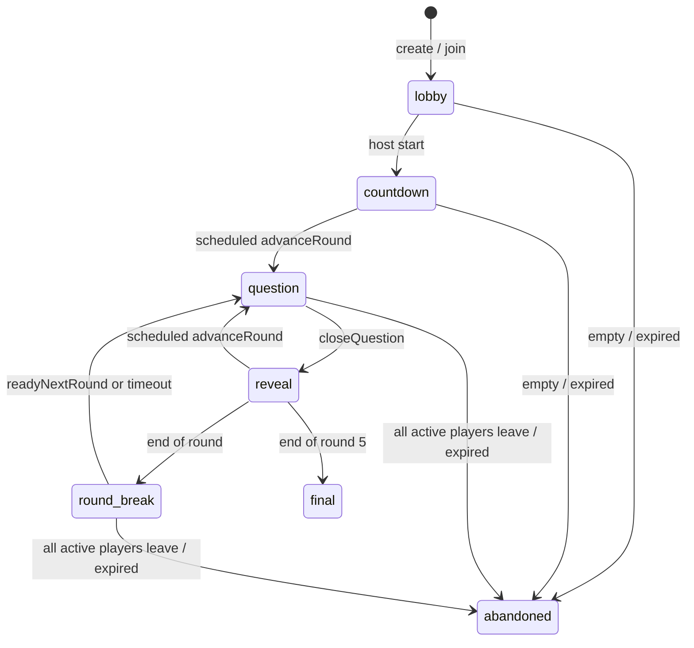

# Challenge Arena

Challenge Arena is the additive backend for synchronous, server-clocked,
multiplayer rooms. It does not replace `liveMatches`, async `duels`, or the
curated football-only modes.

## Scope

MVP modes:

- `1v1`
- `2v2`
- `ffa3`
- `ffa4`
- `ffa5`

Out of scope: ELO, matchmaking, chat, tournaments, leagues, and global
leaderboards.

## State Machine

`closeQuestion` and `advanceRound` are internal scheduled functions. A live
client is never required to move a room forward.

## Server Authority

The room locks all five rounds when the host starts:

- round 1: football quiz (`sport: "football"`)
- round 2: general knowledge (`sport: "knowledge"`)
- round 3: which came first (`category: "which_came_first"`)
- round 4: name the logo (`category: "badge_identification"` with `imageId`)
- round 5: capital cities (`category: "capital_cities"`)

All players share the same `roundChecksums[][]`. Clients never submit
`correctAnswer`, score, checksum, round, question index, or timing. The submit
mutation accepts only `{ arenaId, answer }`, loads the active checksum from the
arena row, loads the question by `quizQuestions.by_checksum`, compares the
stored answer, and derives `serverTimeMs` from `Date.now() - questionStartedAt`.

The reactive room query omits locked checksums and strips the active question's
`correctAnswer`. Current-question answers from other players are hidden until
the question closes.

## Scoring

At close:

- wrong or missed: `0`
- correct: `100 + round(100 * max(0, (window - serverTimeMs) / window)) + rankBonus`
- rank bonus by correct-answer order: `[50, 30, 20, 10, 10]`

Individual `totalScore` is accumulated on the arena player row. In `2v2`, team
leaderboards sum member scores. `round_break` exposes the completed round
leaderboard; `final` exposes the final podium across all rounds.

## Leave Safety

Leaving marks the player `left: true` and freezes their current score. The room
continues for remaining active players. If the host leaves, host ownership
transfers to the first remaining active player. If all active players leave,
the arena is abandoned.

Lobby force-start is available after a short grace period. Unready non-host
players are marked left before the room starts, so an AFK player cannot trap the
room.

## Content Sources

Challenge Arena uses the existing `quizQuestions` table and indexes:

- `by_sport_difficulty`
- `by_checksum`

Capital-city questions are bundled in `challengeArenaContent.ts` and inserted
idempotently when an arena starts if the database lacks them. Logo rounds use
existing `badge_identification` image questions only when at least 10 valid
MCQ-answerable rows are present. If not, the backend substitutes the bounded
`geography_fallback_for_logo` category and records that category in the arena
config.

`challengeArenas.contentStatus` reports the live content counts used for this
decision. `internal.challengeArenas.seedContentGaps` inserts the bounded
capital-city seed set deliberately for environments that have not started an
arena yet.

## Cron

`challenge-arena-expiry` runs hourly and abandons expired non-final arenas in a
bounded batch.

## Frontend (MVP)

The Challenge Arena UI lives in `app/src/pages/ChallengeArenaScreen.tsx` (lazy-
loaded, route `/arena/:code`, wrapped in the global `ErrorBoundary` and gated by
`UsernameRequiredRoute`). Two entry points sit at the top of the Challenge tab:

- `app/src/pages/arena/CreateArenaModal.tsx` — pick mode (1v1 / 2v2 / FFA 3-5)
  then `challengeArenas.create` and redirect to `/arena/<code>`.
- `app/src/pages/arena/JoinArenaModal.tsx` — accept a normalised code and
  redirect to `/arena/<code>`.

Everything inside the room is driven by a single reactive `useQuery` on
`challengeArenas.getRoom`. The component renders one of six sub-views based on
`phase`:

| Phase | Sub-view | Notes |
|-------|----------|-------|
| `lobby` | `LobbyView` | Roster, ready toggles, team picker for 2v2, share/copy link, host start + force-start with countdown gated by `forceStartAvailableAt`. Lists explicit "waiting on" reasons (player count, team validity, unready names). |
| `countdown` | `CountdownView` | 3-2-1 anchored to the first observed phase change (no authoritative start timestamp on the room) plus a preview chip for round 1's category. |
| `question` | `QuestionView` | Server-clocked timer bar (`timer.questionStartedAt` + `timer.questionWindowMs`, offset corrected via `useClockOffset` against `timer.serverNow`). MCQ for football/general/logo (with `QuestionImage` for `imageUrl`), 1-column big two-option layout for `which_came_first`. **Tap-to-submit**: tapping an option calls `submitAnswer` immediately — there is no "lock in" confirm step. Locked state is read back from `room.myCurrentAnswer` so refresh resumes. Errors like "already answered" are swallowed; everything else toasts and clears the pending pick so the player can retry. |
| `reveal` | `RevealView` | Correct answer banner, per-player answer list sorted by points + speed, my own verdict + running total. |
| `round_break` | `RoundBreakView` | Round leaderboard from `room.roundLeaderboard` (team totals in 2v2 are already aggregated by the backend), preview of next category, ready button calling `readyNextRound`, a local 8s "auto-advance" hint (server schedules the real advance). |
| `final` | `FinalView` | Podium grid (1st on top, 2nd/3rd below), full ranking, share card via Web Share API with copy fallback, one-tap `rematch` → navigates to the new arena code. |

Cross-cutting:

- A persistent header strip across every phase shows the code, mode, current
  phase + round, and a **Leave** button that calls `leave` then navigates back
  to `/challenge`. Leaving never blocks; rejoining is just re-opening the same
  code.
- During the `lobby` phase the header also surfaces a **?** help button
  (`HelpCircle`) that opens `ArenaHelpModal`: a dismissible neo-brutalist card
  summarising arena rules (5 rounds × 10 questions, 5 rotating categories,
  tap-to-answer, fastest-correct scoring, ready-up start, leave anytime). The
  modal is mobile-first (anchored bottom-sheet on small screens, centered on
  larger), traps body scroll while open, and closes via the backdrop, the X
  button, "Got it", or Escape. It does not block the lobby — markup is sibling
  to the header so the underlying room state keeps updating.
- Refresh, deep-link, and accidental tab-loss recover automatically: on mount,
  the screen reads the URL code, queries `getRoom`, and if the result is
  `null`, calls `join` once. `join` is idempotent for existing players (it
  patches `lastSeenAt`) and surfaces clean errors for non-lobby rooms.
- All countdowns use the shared helpers in `app/src/lib/arena.ts`
  (`useClockOffset`, `useTick`, `usePhaseAnchor`) so the rendering stays smooth
  without trusting client clocks.
- The screen is wrapped in `ErrorBoundary` at the route, lazy-loaded into its
  own bundle chunk, and styled exclusively with the Neo* primitives + tailwind
  utility classes already used by the rest of the app.

Account requirement: hosting and joining both require an account (no anonymous
player can show up in the roster). Guests landing on `/arena/:code` are
redirected to the sign-up flow with `from=arena`.
