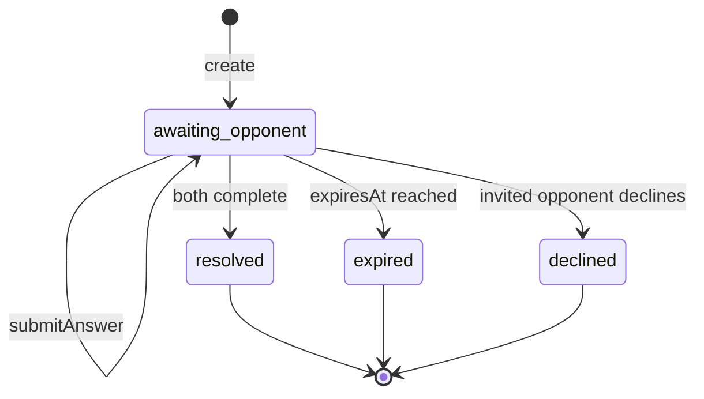

# Async Challenge Duels

This document covers the new backend foundation for asynchronous, seeded,
head-to-head duels. It is additive to the existing `challenges` +
`liveMatches` synchronous flow.

## Status

| Area | Status |
| --- | --- |
| Repo backend code | Complete in repo |
| Frontend wiring | Complete — Duel Hub, play, result + share, rivals, link landing |
| Live backend validation | Functions are present on the configured dev backend (`admired-warthog-495`). The create/play/complete/rematch/link-guest/expiry/rivalry lifecycle is covered by `src/test/duelLifecycleIntegration.test.ts` as a deterministic two-player integration test. A real-browser two-player walk remains the outstanding manual validation step. |
| Remote deployment | Not part of this pass |

## Content Model

Duels use the existing `quizQuestions` table. Sports questions keep their
existing sport key (`football`, `basketball`, `tennis`). Knowledge questions
are first-class quiz rows with `sport: "knowledge"` and use `category` for
taxonomy, including `which_came_first`.

There is no separate knowledge table and no question `type` field. The duel
row stores a locked `questionChecksums[]` list selected server-side from
`quizQuestions.by_sport_difficulty` and later loaded by
`quizQuestions.by_checksum`.

## State Machine

`awaiting_opponent` covers the whole open duel lifecycle: targeted account
duels, link duels waiting to be claimed, and duels where one or both players
are still answering.

## Server-Authoritative Scoring

Clients never submit `correctAnswer`, score, checksum, accuracy, or timing.
The server:

- selects and stores the locked question checksum set at creation
- serves each caller's next question from that set
- stores per-player per-question `servedAt`
- accepts only the next in-order `questionIndex`
- loads the question by checksum and compares against stored `correctAnswer`
- derives `timeTaken` from `Date.now() - servedAt`
- records score and answer metadata on the duel row

Public duel views expose only the caller's own per-question answers. Opponent
views are limited to aggregate score, answered count, and completion state.

## Link Guest Bridge

Link duels can be claimed by an unauthenticated guest using an explicit
ephemeral token supplied by the client. The backend stores only a token hash on
the duel row and records the guest result against that token.

Signup never auto-creates or auto-links an account. After a user creates or
signs into a real account, the client must call `duels.attachGuestResult` with
the same token to attach the link result to that account. Rivalry ledger
updates are deferred until both sides are account-backed.

## Rivalry Ledger

The new `rivalries` table stores a canonical ordered pair:

- `pairKey`
- `userAId`, `userBId`
- `aWins`, `bWins`, `draws`
- `currentStreakHolderId`, `currentStreakLen`
- `lastDuelId`, `updatedAt`

Resolution re-reads the duel row and checks `rivalryAppliedAt` before writing
the ledger, so replayed or concurrent completion paths do not double-count the
same duel.

## Nudges

The backend queues challenge inbox notifications and, for users with email
addresses, schedules Resend email delivery for:

- duel resolved
- opponent beat your completed score
- duel near expiry

The frontend can read the inbox badge via `notifications.unreadCount`.

## Cron

`crons.ts` runs:

- `async-duel-expiry` hourly via `internal.duels.expireStaleDuels`
- `expired-session-cleanup` hourly via paginated session cleanup

Both use bounded batches to stay under Convex transaction limits.

---

## Frontend Wiring

The async duel UI lives under the existing React + Tailwind + Convex frontend
in `app/`. Routes are lazy-loaded behind a top-level `<Suspense>` and wrapped
in `<ErrorBoundary>` (`src/components/ErrorBoundary.tsx`).

### Routes

| Route | Component | Auth |
| --- | --- | --- |
| `/challenge` | `pages/ChallengeScreen.tsx` | account required |
| `/duel/play/:duelId` | `pages/DuelPlayScreen.tsx` | account required |
| `/duel/result/:duelId` | `pages/DuelResultScreen.tsx` | account required |
| `/duel/:linkCode` | `pages/DuelLinkScreen.tsx` | **open** (handles account + guest) |
| `/rivals` | `pages/RivalsScreen.tsx` (default) | account required |
| `/rivals/:opponentUserId` | `pages/RivalsScreen.tsx#RivalDetailScreen` | account required |

The link-landing route is the only duel route reachable as a guest — every
other duel route is gated by `UsernameRequiredRoute`.

### Convex bindings

The frontend touches the following functions directly:

- `duels.listMine` (new query, added alongside this pass) — reactive subscription
  for the Duel Hub. Returns `{ yourTurn, awaiting, resolved }` summaries
  bucketed by `myCompleted` and `status`. Used by `ChallengeScreen`.
- `duels.create`, `duels.rematch`, `duels.decline` — mutations from the hub,
  result screen, and rivals detail screen.
- `duels.getMyDuel` and `duels.getByLinkCode` — both are mutations (each does
  state-changing work like `ensureQuestionServed`), so the play and link
  screens call them imperatively on entry / after each answer. `getMyDuel`
  now also accepts an optional `guestToken` so unauthenticated guest play can
  refresh its own view.
- `duels.getDuelStatus` - read-only reactive query for live resolution
  updates on the result screen and the post-completion waiting state. It does
  not serve questions, claim links, expire duels, or write notifications. It
  returns only aggregate, entitlement-safe status: caller score/completion,
  opponent score/answered count/completion, duel status, and `winnerId` once
  resolved. Guest callers pass the same `guestToken` after `getByLinkCode`
  has claimed the link for that token.
- `duels.submitAnswer` and `duels.complete` — server-authoritative answer
  flow. The client only sends `{ duelId, questionIndex, answer, guestToken? }`;
  the contract test in `src/test/asyncDuelsContract.test.ts` verifies no
  client-side `correctAnswer`, `score`, `checksum`, or `timeTaken` is
  accepted.
- `duels.attachGuestResult` — called from the link landing once a guest has
  finished a duel and signed up. The pending attach is persisted across the
  signup redirect in `localStorage`.
- `rivalries.listMine`, `rivalries.get` — power the rivals strip on the hub,
  the rivals list, and the per-rival detail.
- `notifications.unreadCount` — drives the unread badge on the Challenge
  bottom-nav tab.
- `notifications.markAllRead` — fired when the user opens the hub.

### Guest link bridge — tab-local, never auto-account

The link landing follows the constraint that **signup never auto-creates an
account**. The flow:

1. `getOrCreateGuestDuelToken(linkCode)` mints a 24-char token and stores it
   in `localStorage` under `verveq_duel_guest_token::<linkCode>`. (Helpers
   live in `src/lib/duel.ts`.)
2. The landing calls `duels.getByLinkCode({ linkCode, guestToken })`. If the
   caller is an unauthenticated browser, the backend hashes the token into
   `opponentGuestTokenHash`. If the caller is a signed-in account that isn't
   the challenger, the backend assigns `opponentId` directly (the token is
   ignored).
3. The guest plays through `<DuelPlay duelId guestToken initialView />`. Every
   subsequent `getMyDuel` / `submitAnswer` / `complete` call passes the same
   `guestToken`.
4. After completion, the guest is prompted to create an account. A pending
   attach record (`verveq_pending_duel_attach`) is written to `localStorage`
   with `{ duelId, linkCode, guestToken, savedAt }`, and the user is sent to
   `/?mode=signup&from=duel`.
5. After signup, `LoginScreen` reads the pending hint and redirects the user
   back to `/duel/:linkCode`. The landing then calls
   `duels.attachGuestResult({ duelId, guestToken })`, clears the guest token
   and pending hint, and navigates to `/duel/result/:duelId`.

If the same browser visits the link a second time as a guest with the same
token, the backend recognises the hash and treats it as the same player. If
the link is opened by the challenger, the landing renders a small
"this is your duel" view with the share controls and a deep-link to the
play screen.

### Which Came First UI

`mode: "came_first"` is treated as a distinct duel kind in the create flow
(`CreateDuelModal`). The play screen detects it and renders the question with
a two-option vertical layout instead of the standard A/B/C/D MCQ. Server-side
this is still a row in `quizQuestions` with `category: "which_came_first"`.

### What is intentionally not wired

- The live, real-time `liveMatches` head-to-head path is unchanged. The
  Duel Hub does not replace it; it lives next to it.
- Curated football-only modes (Higher or Lower, VerveGrid, Who Am I, Survival)
  were not touched by this pass.
- ELO is not applied to duels in this pass — `rivalries` is the only ledger
  written on duel resolution. Synchronous live matches still drive ELO via
  `games.ts`.
